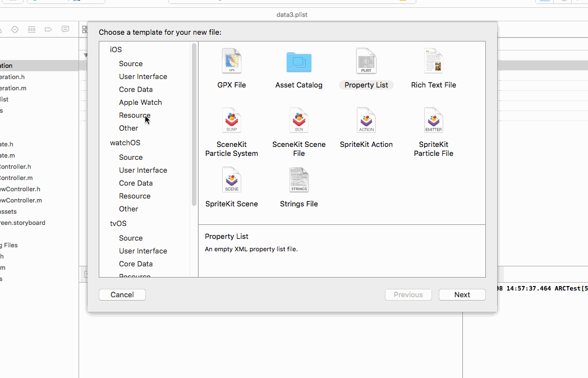
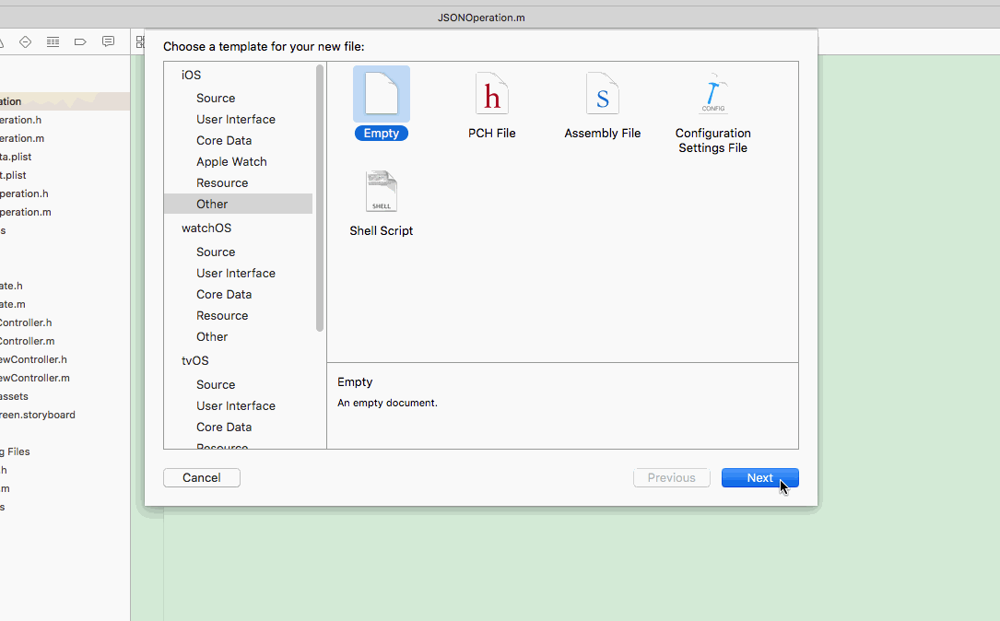

##<span id="data">7.数据处理</span>

### 7.1 plsit

- 创建plist文件及添加数值

  
 
- 数据读取，注意因为plist创建的时候可以选择dictionary或者array，这个也决定了后面怎么去读取它。

```
    NSString* filePath = [[NSBundle mainBundle] pathForResource:@"dict_data" ofType:@"plist"];
    if (!isEmpty(filePath)) {
        NSDictionary* dict = [NSDictionary dictionaryWithContentsOfFile:filePath];
        NSLog(@"%@", dict[@"name"]);

        NSArray* arr = (NSArray*)dict[@"favor"];
        [arr enumerateObjectsUsingBlock:^(id _Nonnull obj, NSUInteger idx, BOOL* _Nonnull stop) {
            NSLog(@"%@", obj);
        }];
    }
    
    NSString *filePath2 = [[NSBundle mainBundle] pathForResource:@"arr_plist" ofType:@"plist"];
    NSArray *arr2 = [NSArray arrayWithContentsOfFile:filePath2];
    NSLog(@"%@", arr2);

```
- 修改数据，注意工程中的arr_plist文件内容没变，但是实际上安装包里面的文件数据是变了的，可以通过open命令打开filePath2路径下的文件。

```
+ (void)writePlistData
{
    NSString* filePath2 = [[NSBundle mainBundle] pathForResource:@"arr_plist" ofType:@"plist"];
    NSMutableArray* arr2 = [NSMutableArray arrayWithContentsOfFile:filePath2];
    NSLog(@"1 : %@", arr2);
    [arr2 addObject:@"new obj"];
    [arr2 writeToFile:filePath2 atomically:YES];
    NSMutableArray* arr3 = [NSMutableArray arrayWithContentsOfFile:filePath2];
    NSLog(@"2 : %@", arr3);
    [arr3 enumerateObjectsUsingBlock:^(id _Nonnull obj, NSUInteger idx, BOOL* _Nonnull stop) {
        NSLog(@"%@", obj);
    }];
}
```

- ###7.2 xml


- ###7.2 JSON

- 创建json文件

  
 
- 数据读写

```
    NSError* error;
    NSString* path = [[NSBundle mainBundle] pathForResource:@"data" ofType:@"json"];

    // 1.iOS自己的API解析
    NSData* data = [NSData dataWithContentsOfFile:path];
    NSDictionary* jsonDict = [NSJSONSerialization JSONObjectWithData:data options:NSJSONReadingMutableLeaves error:&error];
    NSLog(@"%@", jsonDict);

    NSLog(@"name = %@", [jsonDict objectForKey:@"name"]);

    // 2.JSONKit解析
    NSString* jsonStr = [NSString stringWithContentsOfFile:path encoding:NSUTF8StringEncoding error:&error];
    NSLog(@"%@", jsonStr);
    NSDictionary* jsonDict2 = [jsonStr objectFromJSONString];
    NSLog(@"%@", jsonDict2);
    //3.反向生成JSON
    NSDictionary* dict = @{ @"age" : @1,
        @"xx" : @"2",
        @"favor" : @[ @"cai", @"hua" ] };
    NSString* jsonStr = [dict JSONString];
    NSLog(@"%@", jsonStr);
```

注意：目前的JSONKit是MRC的，需要在编译选项里面加入`-fno-objc-arc`,并且修正两个简单的bug。